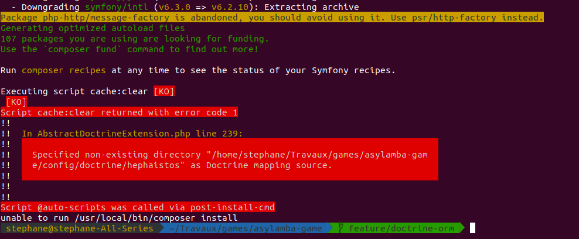
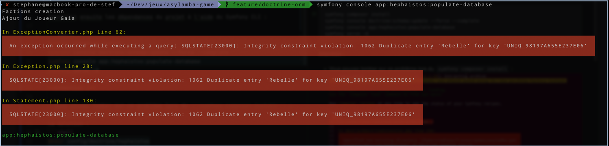

ASYLAMBA : Expansion Stellaire
==============================

[](https://travis-ci.org/rtfmcorp/asylamba-game)
[](https://scrutinizer-ci.com/g/rtfmcorp/asylamba-game/?branch=master)
[](https://scrutinizer-ci.com/g/rtfmcorp/asylamba-game/?branch=master)

Jeu de stragégie en ligne multi-joueur. Visitez [asylamba.com](http://asylamba.com) pour tester le jeu.


For the english version, follow this link : [English version](README.en.md)

Dépendances et prérequis
-----------

- Apache 2.4.7
- PHP 5.5.9
- MySQL 5.5.49
- [yarn](https://yarnpkg.com/getting-started/install)
- [Composer](https://getcomposer.org/)
- [Docker](https://www.docker.com/products/docker-desktop/)
- [Symfony CLI](https://symfony.com/download)

Installation
------------

Cette section traite uniquement de l'installation du jeu et suppose que votre environnement est prêt.

Tout d'abord, vous devez cloner le dépôt du jeu. Pour ce faire, ouvrez une invite de commandes, et entrez la commande suivante :

```sh
git clone git@github.com:Kern046/asylamba-game.git
```

Ensuite, rendez-vous dans le dossier nouvellement créé et changez de branche (temporaire pour l'instant) :
```shell
cd asylamba-game
git checkout feature/doctrine-orm 
```

Lancez ensuite la commande docker suivante pour monter les volumes :
```shell
docker compose up -d
```

Installez ensuite les dépendances du projet à l'aide du Symfony CLI :

```shell
symfony composer install
symfony console doctrine:schema:update --force --complete
symfony console app:hephaistos:populate-database
symfony serve -d
```
Enfin, lancez les 2 commandes suivantes pour installer et lancer le jeu en local :
```shell
yarn install
yarn watch
```

### Acès au projet : 
Une fois tout cela fait, le projet est accessible en local via l'url : [https://localhost:8000/](https://localhost:8000/)


Vous rencontrez un souci ?
-----------

### Problème lors du ```symfony composer install``` :

#### La solution : 
```shell
mkdir config/doctrine/hephaistos
```
---

### Si la commande populate-database à planté, que vous la relancez dans la foulée et que vous obtenez cette erreur : 
#### La solution :
  Pensez à agrandir votre MEMORY_LIMIT dans votre php.ini s'il est à 256M et relancez votre serveur Symfony et docker. Ensuite faite :
```shell
symfony console doctrine:database:drop --force
symfony console doctrine:database:create
symfony console doctrine:schema:update --force --complete
symfony console app:hephaistos:populate-database
```
La commmande populate-database peut prendre un peu de temps.

---

### Dans certain cas, vous pouvez avoir cette erreur : 
```shell
Error: @vitejs/plugin-vue requires vue (>=3.2.13) or @vue/compiler-sfc to be present in the dependency tree.
```
#### La solution : 
```shell
yarn add vue@3.2.36
```
---

### Si vous avez ce message d'erreur :

#### La solution :
```shell
symfony server:ca:install
```
Et relancer le serveur Symfony


Structure du projet
-------------------

Le jeu a été développé sans framework aucun, cela pour des raisons de performances et de besoins spécifiques pour un jeu de ce type. Il y a donc vraiment peu de dépendances à des librairies externes. Les dépendances sont citées plus haut, nous ajoutons à cela jQuery ainsi que LESS pour la compilation CSS. Tout le reste est en pur HTML/CSS/JavaScript/PHP.

Le projet contient deux dossiers principaux :

- `public/` : pour les images, le CSS, le JavaScript et les logs
- `system/` : pour les vues, le cœur du jeu et tout ce qui est "mécanique"

Le dossier system est plutôt fourni mais les noms des dossiers qu'il contient sont assez explicites. Le sous-dossier `system/modules` mérite toutefois quelques précisions. Il contient toutes les classes principales du jeu qui sont regroupées en modules. Chacun de ces modules possède un nom de dieu grec. La liste se trouve ci-dessous.


| Module    | Fonction |
|-----------|----------|
| Arès      | la guerre (commandants, combats, flottes) |
| Artémis   | l'espionnage |
| Athéna    | la base ortibale (base orbitale, bâtiments, envois commerciaux, recyclage, constructions, transactions) |
| Atlas     | les classements (faction, joueur) |
| Déméter   | les factions (élections, lois, forums) |
| Gaïa      | la galaxie (secteurs, systèmes solaires, planètes) |
| Hermès    | la communication (messagerie, notification) |
| Prométhée | la technologie (recherches, technologies) |
| Zeus      | le joueur (tutoriel, gestion des bonus, envois de crédit) |


Contribuer
----------

Si vous souhaitez contribuer au projet, c'est possible ! Merci de prendre connaissance des [instructions](CONTRIBUTING.md) avant de commencer.


Team
----

Créateurs du jeu :

* [abdelaz3r](https://github.com/abdelaz3r)
* [acknowledge](https://github.com/acknowledge)
* [N03](https://github.com/N03)

Contributeurs :

* [Kern046](https://github.com/Kern046)
* [PapyRusky](https://github.com/PapyRuski)
* [Liador](https://github.com/Liador)
* Toi ? :)


Licence
-------

[WIP]
